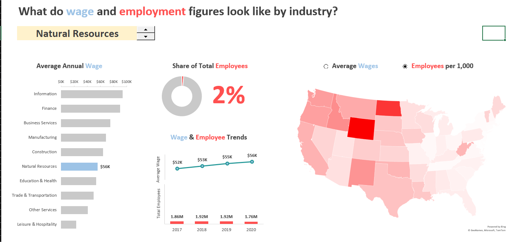
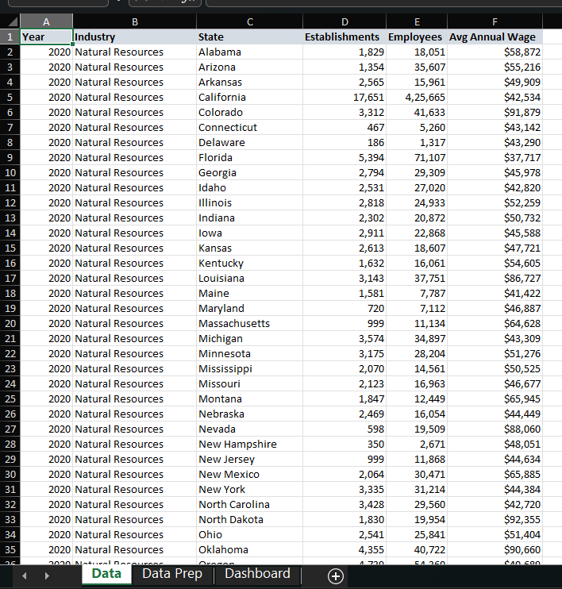
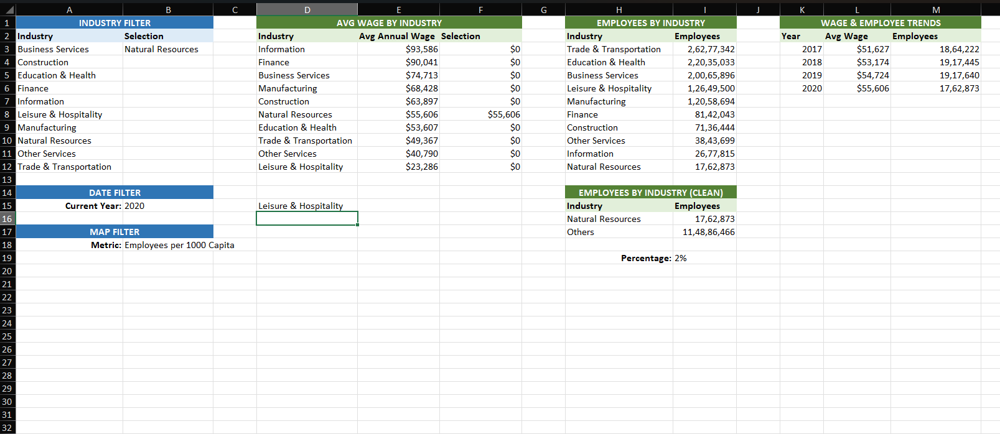
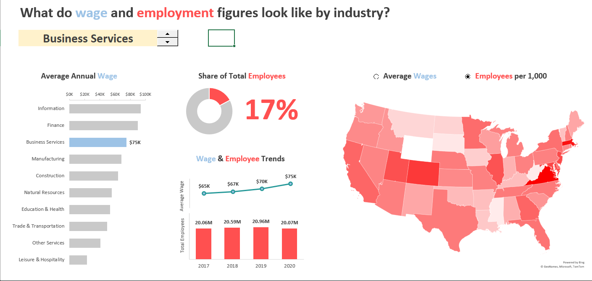
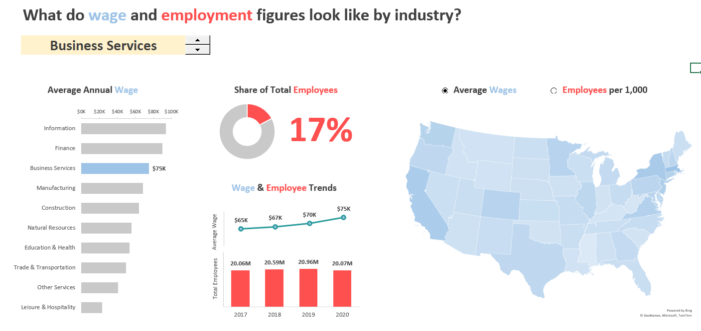

# **US_Employment_dashboard**

---

## Project Overview

A data analytics Project on US Job market trends using Excel dashboard.
This project was created as part of my Business Intelligence certification journey with Maven Analytics. 
- The goal is to transform raw labor market data into an **interactive Excel dashboard** that users can explore by sector, state, or salary level to make informed decisions.

---

## Tools Used

- **Microsoft Excel** 
  
---

## Dashboard Overview Snapshot

---

## Dataset Preview

Screenshot of Cleaned and structured dataset

NOTE: dataset is sourced from MavenAnalytics

---

## Data Preparation Snapshots

Before building the dashboards, I prepared the data by:
- Cleaning inconsistencies and null values
- Standardizing field names , created tables and conditional formating
- created charts and other visuals 
- Adding helper columns for slicing/filtering

📸 

---
## Key Findings

**CASE**: A User wants to work in the business service sector. They can navigates the dashboard using the slicer and button to filter results, focusing on a specific sector. 

Through the dashboard, they can
- Instantly view top-paying states for that sector
- Identify  states that have the most job opportunities
- compare multiple sectors or locations for better decision making.

---

## What I Learned

- Data transformation and cleaning using native Excel functions
- Learned to design with end users in mind, focusing on clarity and usability.
- Relying only on formulas and Excel tables **without PivotTables** pushed me to understand how dynamic dashboards really work.
- Practiced data storytelling: using chart types, color schemes, and layout to guide users through insights.
- Gained confidence in Excel as a powerful tool for business intelligence, not just spreadsheets.

---

